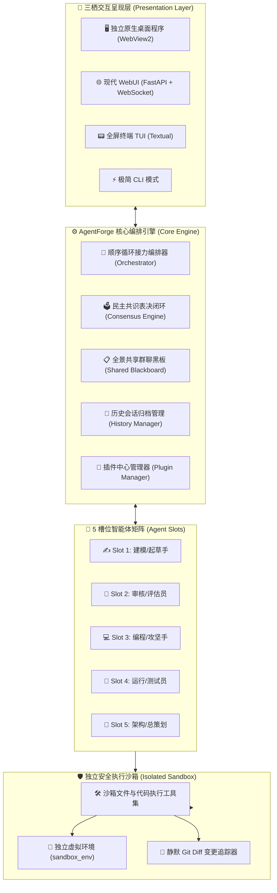

<div align="center">

# ⚡ AgentForge (智铸)

> **现代化多智能体圆桌接力协同开发与创作平台**  
> *A Modern Multi-Agent Collaborative Round-Table Platform for Autonomous Software Engineering & Creative Writing*

[](LICENSE)
[](https://www.python.org/)
[](https://fastapi.tiangolo.com/)
[](https://pywebview.flowrl.com/)
[]()
[](https://github.com/)

[English Overview](#-english-summary) · [核心特性](#-核心特性概览) · [快速开始](#-快速开始-quickstart) · [系统架构](#-系统架构) · [插件开发](#-插件中心与开发者-sdk) · [快捷键](#-常用快捷键一览)

</div>

---

## 🌟 核心特性概览

### 1. 🤖 5 槽位多角色圆桌接力 (Round-Robin Group Chat)
- **自由定制分工**：支持最多 5 位 AI 协同成员（如总策划、作家、审核员、编程手、测试员或自定义角色）；
- **全景共享黑板**：场内所有成员的发言、思考过程、工具调用与代码改动对全场实时公开透明；
- **全自动交接接力**：成员按槽位绝对顺序轮流发言并执行操作，自动推进复杂任务直至目标圆满达成。

### 2. 🧠 深度思考可视化与强度调控 (Deep Thinking Mode)
- **实时思考折叠框**：大模型（如 DeepSeek-R1 / Qwen-QwQ）的推理过程实时流式折叠展示，附带精准字数统计与耗时记录；
- **思考强度三档可调**：支持在设置（`F1`）中为每个角色独立配置思考模式：
  - `深度思考 (Deep)`：全量推理推导；
  - `轻度思考 (Lite)`：限制 1024 Token 轻量思考；
  - `关闭思考 (Off)`：零思考延迟，极速出字；
- **只思考不回答自动补齐**：若推理模型思考完毕后忘记输出正文，系统自动触发零延迟极速补齐，绝不留白。

### 3. 🛡️ 内置独立 AI Python 测试沙箱 (`sandbox_env`)
- **宿主系统物理隔离**：系统在 `sandbox_env/` 下内置专供 AI 使用的独立虚拟环境；
- **命令强环境变量注入**：AI 执行 `python ...`、`pip install ...` 等终端命令时，自动绑定沙箱环境，绝不污染或破坏宿主系统与主程序。

### 4. 🗳️ 全员在线民主表决闭环 (Democratic Consensus Voting)
- 当任意成员认为目标已达成时，系统自动启动**【全员在线表决】**程序；
- 在场所有 AI 开启深度思考逐项审查交付成果；
- **全票赞成方可圆满交付**；若有异议，系统自动将所有修改意见汇总为**强制改进清单**，注入下一轮接力中直至彻底解决！

### 5. 🖥️ 多形态三栖覆盖 (Native Desktop EXE / WebUI / TUI / CLI)
- **独立原生桌面程序 (推荐)**：基于 Edge WebView2 引擎，拥有原生窗口体验与极低资源占用（**内存仅 ~20MB-30MB**），无控制台黑框、无浏览器标签页干扰；
- **现代化 WebUI 模式**：60fps 硬件加速动效、流式打字机效果、自适应双栏布局；
- **全屏终端 TUI 模式**：基于 Textual 构建的极客沉浸式纯命令行终端 UI；
- **极简 CLI 模式**：适合自动化脚本与 CI/CD 流程调用。

### 6. 🧀 奶酪暖色质感美学 & 4 套精美主题
- **默认「🧀 奶酪暖色」**：温润乳白奶油底色、黄油白毛玻璃卡片、细腻蜂蜜金边框、深醇意式浓缩棕文字，舒适护眼；
- **顶栏主题切换器**：支持在 **🧀 奶酪暖色**、**🌌 暗夜科技**、**☕ 燕麦拿铁**、**🌿 极简雅白** 之间实时无缝切换，并自动持久化保存。

### 7. 🧩 插件中心与扩展架构 (Plugin Hub SDK)
- 内置 5 大官方生态扩展插件：
  - 🔍 **联网搜索与知识增强 (`web_search_enhancer`)**
  - 📊 **Mermaid 架构流程图实时渲染 (`mermaid_chart_live`)**
  - 🎙️ **多角色音色语音播报 (`voice_speech_tts`)**
  - 🗄️ **超长工作区向量检索记忆 (`vector_memory_rag`)**
  - 🛠️ **自定义 Python 脚本钩子 (`custom_python_hook`)**
- 插件支持一键独立启用/停用，并提供标准 Python 钩子接口供开发者任意拓展。

### 8. 🔍 Modern Git Diff 审查器 (VS Code / GitHub 风格)
- 全新结构化卡片对比器，展示文件改动统计（`+24 -8`）、双列对齐行号、行级翡翠绿与宝石红高亮；
- Windows 平台下进程调用全面开启 `CREATE_NO_WINDOW` 静默机制，**彻底杜绝任何黑框窗口一闪而过**。

---

## 🏛️ 系统架构 (Architecture)



---

## 🚀 快速开始 (Quickstart)

### 环境要求
- **操作系统**：Windows 10/11、macOS 或 Linux
- **Python 版本**：Python 3.10 及以上（推荐 Python 3.11 / 3.12）

---

### 方式一：独立原生桌面窗口（最推荐 · 免环境直接使用）

1. **直接运行独立桌面窗口**：
   - **双击 `run_desktop.bat`**（或 `run.bat`）：直接拉起独立的原生桌面程序窗口（无控制台黑框、无浏览器标签页，超低内存占用）；
2. **一键构建独立 Windows EXE 与 Windows 安装向导 (Setup.exe)**：
   - **双击 `build_exe.bat`**：系统将自动通过 PyInstaller 编译生成 `dist/AgentForge/AgentForge.exe`；
   - **双击 `build_installer.bat`**（基于 `AgentForge_Setup.iss`）：一键通过 Inno Setup 编译生成现代化 Windows 安装向导 `output/AgentForge_v1.0.0_Windows_Setup.exe`，支持创建桌面图标、开机菜单与一键卸载保留数据；
   - 免安装 Python 环境，在任意 Windows 10/11 电脑上双击即可直接安装与运行！

---

### 方式二：浏览器 WebUI 模式

- **双击 `run_gui.bat`**：启动 WebUI 并自动在浏览器中打开 `http://127.0.0.1:8000`；
- **双击 `run_tui.bat`**：启动全屏终端 TUI 交互界面。

---

### 方式三：命令行手动启动

```bash
# 1. 创建并激活虚拟环境
python -m venv .venv

# Windows
.venv\Scripts\activate
# macOS / Linux
source .venv/bin/activate

# 2. 安装运行依赖
pip install -r requirements.txt

# 3. 启动形态选择
# 启动独立原生桌面窗口
python main.py --app

# 启动 WebUI 浏览器端
python main.py --gui

# 启动终端全屏 TUI 界面
python main.py --tui

# 启动极简 CLI 模式
python main.py --cli --goal "写一个高并发异步爬虫"
```

---

## ⌨️ 常用快捷键一览

| 快捷键 | 界面按钮 | 功能说明 |
| :--- | :--- | :--- |
| **`F1`** | `[⚙️ 设置]` | 打开 **API 供应商管理**、**5 角色槽位分工** 与 **工作区沙箱** 设置弹窗 |
| **`F2`** | `[📜 历史]` | 打开 **历史会话管理器**（浏览历史纪要、删除会话、一键清空） |
| **`Ctrl + P`** | `[⏸ 暂停/调整]` | **中途暂停会议** / **恢复继续接力** |
| **`Enter`** | `[▶ 调整并继续]` | 暂停状态下输入指导意见并回车，注入新方向继续协同 |
| **`Ctrl + C` / `Esc`** | `[⏹ 结束]` | 终止当前任务或关闭弹窗 |
| **`Ctrl + L`** | `[🧹 清屏]` | 清空当前屏幕实时滚动日志 (后台数据完整保留) |

---

## 🔌 插件中心与开发者 SDK

在 `plugins/` 目录下继承 `BasePlugin` 即可快速创建自定义插件：

```python
from plugins.base import BasePlugin, PluginMetadata
from core.memory import AgentMessage

class MyCustomPlugin(BasePlugin):
    metadata = PluginMetadata(
        id="my_custom_plugin",
        name="我的专属插件",
        version="1.0.0",
        description="监听智能体发言并进行自定义操作",
        icon="✨"
    )

    async def on_agent_after_speak(self, message: AgentMessage) -> None:
        print(f"[{message.sender_name}] 刚刚发言: {message.content[:50]}...")
```

---

## 📁 目录结构说明

```text
├── main.py                     # 主程序入口 (支持 Desktop App, WebUI, TUI, CLI 多形态)
├── desktop.py                  # 基于 pywebview 的独立原生桌面应用启动器
├── config.py                   # 全局配置管理与自愈校验引擎
├── build_exe.py                # PyInstaller 一键独立 EXE 打包编译脚本
├── create_icon.py              # 高清应用品牌图标生成器
│
├── run.bat                     # Windows 快速启动桌面程序
├── run_desktop.bat             # 独立桌面窗口启动脚本
├── run_gui.bat                 # WebUI 浏览器端启动脚本
├── run_tui.bat                 # 终端 TUI 启动脚本
├── build_exe.bat               # Windows 一键编译 EXE 批处理
│
├── assets/                     # 应用程序品牌图标 (icon.ico, icon.png)
├── gui/                        # 现代化 WebUI & Desktop 前端模块
│   ├── server.py               # FastAPI + WebSocket 全双工后端服务
│   ├── templates/              # HTML5 单页 App 模板
│   └── static/                 # CSS3 奶酪暖色与多主题设计系统、JS 反应式控制器
│
├── plugins/                    # 插件中心与生态扩展系统
│   ├── base.py                 # 插件标准基类与元数据模型
│   └── manager.py              # 插件加载器与预装生态插件
│
├── core/                       # 核心业务逻辑
│   ├── llm_client.py           # 异步流式大模型通信客户端 (含思考模式解析)
│   ├── memory.py               # 全景共享群聊黑板与事件总线
│   ├── orchestrator.py         # 顺序接力编排器与全员民主表决闭环
│   ├── history_manager.py      # 历史会话自动归档与纪要管理
│   └── tools.py                # 独立隔离沙箱文件与系统执行工具集 (静默无黑框)
│
├── agents/                     # 智能体定义驱动
├── tui/                        # Textual 现代化终端用户界面
├── history/                    # 历史会话自动归档目录 (*.md / *.json)
└── 测试软件/                   # 默认沙箱工作区根目录
```

---

## 🌐 English Summary

**AgentForge** is an advanced, ultra-lightweight, multi-agent collaborative round-table platform for autonomous software development and content creation.

- **Multi-Modal UI**: Supports native desktop windows (Edge WebView2, < 30MB RAM), modern responsive WebUI, full-screen Terminal UI (Textual), and automated CLI.
- **Deep Thinking Visualization**: Live accordion stream with word counts and three selectable thinking intensities (Deep / Lite / Off).
- **Isolated Python Sandbox**: Dedicated `sandbox_env` virtual environment prevents modifications to host system files.
- **Democratic Consensus Voting**: Unanimous peer review required before delivery; issues automatically form actionable todo lists.
- **Zero-Flash Execution**: Native Windows `CREATE_NO_WINDOW` subprocess execution with a VS Code-style Git Diff inspector.
- **Cheese Theme Aesthetic**: Soft, warm cheese cream palette with instant multi-theme switching.

---

## 📄 开源许可证 (License)

本项目采用 [MIT License](LICENSE) 许可证开源，欢迎自由使用、修改与分发。
